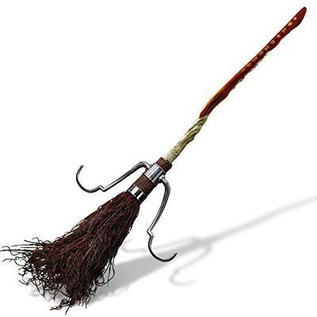
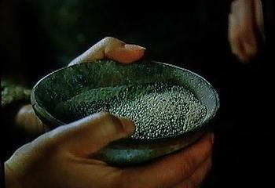
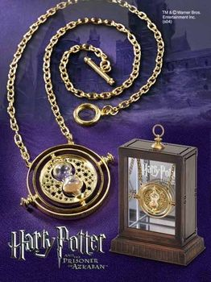
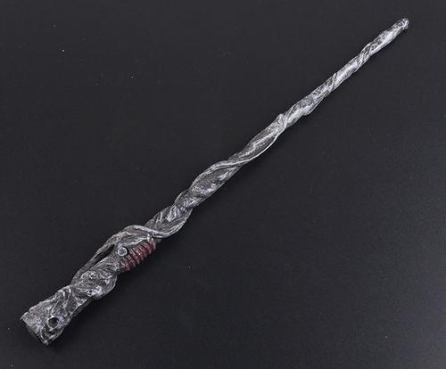

<!doctype html>
<html lang="en">
  <head>
    <!-- Required meta tags -->
    <meta charset="utf-8">
    <meta name="viewport" content="width=device-width, initial-scale=1, shrink-to-fit=no">

    <!-- Bootstrap CSS -->
    <link rel="stylesheet" href="https://stackpath.bootstrapcdn.com/bootstrap/4.3.1/css/bootstrap.min.css" integrity="sha384-ggOyR0iXCbMQv3Xipma34MD+dH/1fQ784/j6cY/iJTQUOhcWr7x9JvoRxT2MZw1T" crossorigin="anonymous">
    <link href="https://fonts.googleapis.com/css?family=Fascinate+Inline|Indie+Flower" rel="stylesheet">
    <link rel="stylesheet" href="https://use.fontawesome.com/releases/v5.8.1/css/all.css" integrity="sha384-50oBUHEmvpQ+1lW4y57PTFmhCaXp0ML5d60M1M7uH2+nqUivzIebhndOJK28anvf" crossorigin="anonymous">
    <link rel="stylesheet" href="style.css">
    <link rel="stylesheet" href="animate.css">
    <title>HomePage</title>
  </head>
  <body class="home">
    <nav class="navbar navbar-light bg-secondary">
            

                <a class="navbar-brand" href="#"><i class="fab fa-hire-a-helper"></i>  MagicWorld
                </a>
            

            <ul class="nav mr-auto">
                <li class="nav-item dropdown">
                    <a class="nav-link dropdown-toggle text-light" href="#" id="navbarDropdown" role="button" data-toggle="dropdown" aria-haspopup="true" aria-expanded="false">
                    <i class="fas fa-align-justify" width="40" height="40"></i>
                    </a>
                    

                            <a class="dropdown-item" href="about.html">About Page</a>
                            <a class="dropdown-item" href="catalog.html">Catalog Page</a>
                            <a class="dropdown-item" href="cart.html">Cart Page</a>
                            

                            <a class="dropdown-item" href="checkout.html">Check Out Right Here</a>
                          

                </li>
            </ul>
    </nav>    
    <h1 class="header animated heartBeat delay-2s slow text-info text-center">Diagon Alley</h1>
    

        <h2 class="text-light text-center">A cobblestoned shopping area  for the wizarding world, where  Hogwarts students can  purchase necessary supplies</h2>
      

        

            
            Flying broomstick is the vehicle of magic world which was imagined and created
             by many writers before the 20th century. It has magic and can fly. It is the most commonly used vehicle for wizards 
             and witches. It is also used in sports competitions in magic world, such as Quiddich................ 
          
<a class="b btn btn-secondary btn-lg" href="cart.html" role="button">BUY</a>

        

        

          
          A shiny powder that a wizard can use through a fireplace. The flame with flying powder is green. 
          It was invented by Ignetta Westsmith (1227-1320).
          Only fireplaces connected to the flyway network can be transmitted. When transmitting, the user must stand in front of the fireplace........ 
          <a class="b btn btn-secondary btn-lg" href="cart.html" role="button">BUY</a>
        

        

                This is an instrument for time travel.
                In Harry Potter and the Prisoners of Azkaban, Professor McGonagall lent Hermione the time converter so
                 that Hermione could complete all the subjects she wanted........ 
                    <a class="b btn btn-secondary btn-lg" href="cart.html" role="button">BUY</a>
        

        

                It is a long wooden strip with inner core. 
                There are many different types of wood and cores available. Every magic wand is unique. If you use a wand 
                that does not belong to you, the magic effect will be discounted............ 
                    <a class="b btn btn-secondary btn-lg" href="cart.html" role="button">BUY</a>
        

      

    

       <a href="top">Back To Top</a>
    
        
    <!-- Optional JavaScript -->
    <!-- jQuery first, then Popper.js, then Bootstrap JS -->
    
    
    
  </body>
</html>
